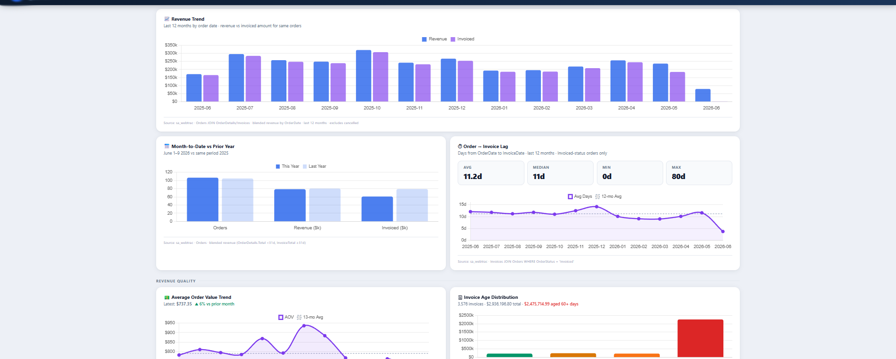

[](https://github.com/ryanmcarden/natural-language-sql-mcp/actions/workflows/ci.yml)

# Embroidery Business MCP Server

A production [Model Context Protocol](https://modelcontextprotocol.io) server that connects Claude directly to an existing SQL Server database. Built for a custom embroidery shop; adaptable to any order management system on MSSQL.

Staff ask questions in plain English. Claude figures out which tools to call, chains them, and answers — no query writing, no dashboards, no tickets to the dev team.

---

## Demo



> **Staff:** "Which of our Port Authority products have margin below 25%? And when did we last sell each one?"

Claude calls `analyze_product_pricing(brand="Port Authority", max_margin=25)` → `get_product_sales_by_period()` for each result, then returns a ranked table with margin, last sale date, and revenue exposure — in one response.

> **Staff:** "Find any orders that look like they might blow up this week."

Claude calls `find_order_risks(days=14)`, cross-references `get_order_history()` on flagged orders, and returns a prioritized list with the specific risk signal for each — overdue, missing tracking, rush notes in staff comments, spoilage flags.

> **Staff:** "Give me everything on Acme Corp before my call with them."

Claude calls `get_customer_360(search="Acme Corp")` → summarizes open orders, revenue trend, what they usually buy, last contact notes, and any outstanding risks. One question, eight tool calls, one briefing.

---

## Why MCP instead of a custom API or RAG?

The shop had an existing MSSQL database with years of order history, a complex schema, and no budget or appetite for schema changes. The options were:

**Custom API + chatbot** — would require designing endpoints upfront and rebuilding them every time someone asked for a new type of question. Staff questions don't fit a finite set of routes.

**RAG over exported data** — works for document search but terrible for structured queries. "What's our margin on Port Authority hats at 48 units?" is a join and a calculation, not a semantic search problem.

**MCP** — Claude decides at runtime which tools to call and in what order, based on the question. Adding a new capability means adding one Python function with a docstring. The model handles the query planning; the server handles only data retrieval. This is the right split.

The result: a non-technical staff member can ask a question that would have taken a developer 20 minutes to write a one-off query for, and get the answer in seconds.

---

## Architecture

```
Claude Desktop / Claude API
        │
        │  MCP (stdio or HTTP/SSE)
        ▼
  server.py (FastMCP)          ← 40+ read-only tool definitions
        │
        ▼
  database.py                  ← all SQL Server queries (pyodbc)
        │  read-only login (db_datareader)
        ▼
  SQL Server (existing DB)     ← no schema changes, no migration
```

Two transport modes ship out of the box:
- **`stdio`** — Claude Desktop integration (default)
- **`http`** — streamable HTTP/SSE via uvicorn, for multi-user or API deployments

A Node.js companion (`server.js`) exposes a product search webhook for n8n automation workflows.

---

## Tool surface (40+ tools)

### Customer intelligence
| Tool | What it does |
|------|-------------|
| `search_customers` | Find by org name or email |
| `get_customer` | Full profile + 10 recent orders |
| `get_customer_360` | Full briefing: profile, contacts, revenue, open orders, product history, notes |
| `get_customer_product_history` | What they usually buy, colors, sizes, seasonal patterns |
| `get_reorder_opportunities` | Customers with purchase history who haven't reordered recently |

### Orders
| Tool | What it does |
|------|-------------|
| `list_orders` | Filter by status, customer, or keyword |
| `get_order` | Full order: line items, embroidery specs, decoration, invoice, assignments, history |
| `get_order_history` | Full audit trail |
| `get_contact_history` | Staff notes, calls, emails linked to an order or customer |
| `explain_order_timeline` | Narrative timeline assembled from all order data sources |
| `find_order_risks` | Overdue, stalled, rush, missing tracking, or risk keywords in notes |
| `find_similar_past_orders` | Historical precedents by product, category, qty, or customer type |

### Sales & analytics
| Tool | What it does |
|------|-------------|
| `get_best_sellers` | Top products by invoiced revenue |
| `get_best_sellers_filtered` | Filter by category, brand, or color |
| `get_sales_breakdown` | Revenue by category, brand, and color |
| `get_orders_by_period` | Volume and revenue grouped by day/week/month/year |
| `get_product_sales_by_period` | Single-product sales trend over time |
| `search_invoices` | Filter by date, amount, customer; always returns running totals |

### Pricing & margins
| Tool | What it does |
|------|-------------|
| `analyze_product_pricing` | Rank catalog by price, cost, margin, or markup at any qty breakpoint |
| `get_product_cost_and_price` | Supplier cost + sale price + margin at all qty breaks for one product |
| `lookup_product_costs` | Batch cost/margin lookup across multiple products |
| `get_product_pricing` | Full pricing with embroidery and digitizing fees |
| `find_margin_leaks` | Products with low margin and meaningful revenue exposure |

### Products & designs
| Tool | What it does |
|------|-------------|
| `search_products` / `search_products_advanced` | Keyword + multi-filter catalog search |
| `get_product_colors_sizes` | Available colors and sizes |
| `get_popular_colors` | Most-ordered colors for a product, ranked by quantity |
| `list_embroidery_designs` / `get_embroidery_design` | Design catalog with stitch count, dimensions, usage history |
| `get_design_usage_history` | Which orders and customers have used a design |
| `get_orders_by_prodno` | All orders containing a specific product |

---

## Setup — 3 steps

### 1. Create a read-only SQL login (run once in SSMS)

```sql
CREATE LOGIN embroidery_mcp_ro WITH PASSWORD = 'ChooseAStrongPassword!';
USE your_database_name;
CREATE USER embroidery_mcp_ro FOR LOGIN embroidery_mcp_ro;
EXEC sp_addrolemember 'db_datareader', 'embroidery_mcp_ro';
```

`db_datareader` grants `SELECT` on every table. Nothing else. No schema changes required.

### 2. Configure environment

```bash
cp .env.example .env
# Edit .env — set DB_SERVER, DB_NAME, DB_USER, DB_PASSWORD
```

### 3a. Run with Docker (recommended)

```bash
docker compose up --build
```

Server starts at `http://localhost:8000/mcp`.

### 3b. Run locally (stdio mode for Claude Desktop)

```bash
pip install -r requirements.txt
python server.py
```

---

## Connecting to Claude Desktop

**HTTP mode** — add to `claude_desktop_config.json`:
```json
{
  "mcpServers": {
    "embroidery": {
      "url": "http://localhost:8000/mcp"
    }
  }
}
```

**Stdio mode** — add to `claude_desktop_config.json`:
```json
{
  "mcpServers": {
    "embroidery": {
      "command": "python",
      "args": ["/path/to/embroidery-mcp/server.py"]
    }
  }
}
```

---

## Implementation notes

**Thread-local connections** — `database.py` uses `threading.local()` to give each thread its own `pyodbc` connection. Required for HTTP mode: FastMCP runs tool handlers in a thread pool, and pyodbc connections are not thread-safe. Most tutorials miss this and hit mysterious errors under concurrent load.

**Schema introspection caching** — `_table_exists()` and `_columns_for_table()` query `INFORMATION_SCHEMA` once per table and cache the result. The server adapts to schema variation at startup rather than hardcoding column assumptions. Add a table, add a tool — no other changes needed.

**Dual transport** — `MCP_TRANSPORT=stdio` (default) wraps stdin with a `FilteredStdin` shim to discard blank lines before they reach the MCP parser. `MCP_TRANSPORT=http` switches to a uvicorn ASGI server with streamable HTTP/SSE, suitable for shared or hosted deployments.

**Read-only enforced at two layers** — the database login has `db_datareader` only (enforced by SQL Server). The FastMCP server declaration is also annotated `READ-ONLY`. There are no write, update, or delete tools anywhere in the codebase.

---

## Project structure

```
embroidery-mcp/
├── server.py              # FastMCP tool definitions (Python MCP server)
├── database.py            # All SQL Server queries
├── server.js              # Node.js MCP + webhook server (n8n integration)
├── search.js              # Product search logic (used by server.js)
├── dashboard.py           # React dashboard backend (optional)
├── dashboard.html         # Compiled dashboard frontend (optional)
├── products.json          # Product catalog cache (for Node.js server)
├── system_prompt.md       # Claude system prompt for staff-facing deployments
├── schema.sql             # DB setup notes (read-only login instructions)
├── requirements.txt       # Python dependencies
├── package.json           # Node.js dependencies
├── Dockerfile
├── docker-compose.yml
└── .env.example           # Environment template — copy to .env
```

---

## Schema assumptions

Targets a typical MSSQL order management database. Core tables expected:

- `Customers` — organizations, `CustomerID`, `Organization`, `Email`
- `Contacts` — individuals, linked via `CustID → Customers.CustomerID`
- `Orders` — referenced by `OrderNo` (human-readable varchar), not internal `OrderID`
- `OrderDetails` — line items: `ProdNo`, `Qty`, `Color`, `Size`
- `EmbDesign` — design catalog: stitch counts, dimensions, digitizer notes
- `Embellishment` — pricing table: quantity brackets, digitizing fees, per-garment rates
- `Invoices` — `InvoiceTotal`, `EmbTotal`, `SalesTax`, `Shipping`
- `OrderHistory` / `ContactHistory` — audit log and staff notes

The server uses `INFORMATION_SCHEMA` introspection at startup, so it degrades gracefully if your schema differs rather than crashing on a missing column.

---

## License

MIT
